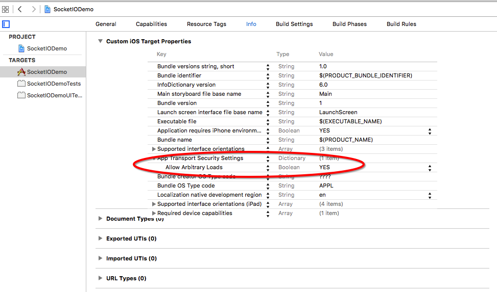

# Socket.io_Objective-C
socket.io-client-swift realization of Objective-C

## 说明

该项目是集成 Socket.io官方库[socket.io-client-swift](https://github.com/socketio/socket.io-client-swift)的一个Object-C的实现。主要用于总结往我的OC项目中集成socket.io-client-swift的步骤以及遇到的问题。

## Xcode版本

使用 XCode7.3 。因为当我使用XCode8.x的时候，xcode提示让我自动升级适配 swift3.0 ,当时当XCode版本是7.3的时候，就没有这种现象。

## 集成步骤

* 首先创建Podfile，然后在该文件中输入以下内容

```
use_frameworks!

target 'SocketIODemo' do
    pod 'Socket.IO-Client-Swift'
end
```
* 在你使用socket.io的地方导入头文件

```
#import <SocketIOClientSwift/SocketIOClientSwift-Swift.h>
```

## 具体代码（登录）

```
#import "ViewController.h"
#import <SocketIOClientSwift/SocketIOClientSwift-Swift.h>

@interface ViewController ()

@end

@implementation ViewController

- (void)viewDidLoad {
    [super viewDidLoad];
    // Do any additional setup after loading the view, typically from a nib.
    
    NSURL *url = [[NSURL alloc] initWithString:@"http://10.12.23.232:9000"];
    SocketIOClient *socket = [[SocketIOClient alloc] initWithSocketURL:url options:@{@"log": @YES, @"forcePolling": @YES}];
    
    [socket on:@"connect" callback:^(NSArray* data, SocketAckEmitter* ack) {
        [socket emit:@"login" withItems:@[@"qizhang123"]];
    }];
    
    [socket on:@"login" callback:^(NSArray* data, SocketAckEmitter* ack) {
        
    }];
    [socket connect];
    
}

```

## 使用XCode7.3发送http请求注意

由于从XCode7.x开始，其默认只支持安全的网络请求https,所以有时候当你发送http请求的时候可能会一直失败，所以需要注意配置一下xcode7.x

添加如下配置项：


## 关于socket.io

关于socket.io的其它具体方法，可以参考[socket.io-client-swift](https://github.com/socketio/socket.io-client-swift)

## MaxwellQi

[More about me ...](https://maxwellqi.github.io/about-me/)